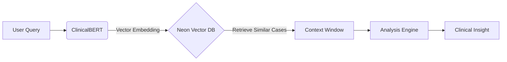

# Medical RAG System: AI-Powered Clinical Intelligence
## A Guide for Medical Students

---

## 1. The Challenge: Information Overload

- **Problem**: Electronic Health Records (EHRs) contain vast amounts of unstructured text (notes, discharge summaries, history).
- **Impact**: Retrieving specific clinical details quickly is difficult and time-consuming.
- **Risk**: Critical information might be missed during patient care.

---

## 2. The Solution: Retrieval-Augmented Generation (RAG)

We built a system that combines **Search** with **AI Understanding**.

- **Retrieval**: Finds the most relevant medical cases from thousands of records.
- **Augmentation**: Uses ClinicalBERT to understand the medical context.
- **Generation**: Synthesizes the information into clear, evidence-based insights.

---

## 3. Core Technology: ClinicalBERT

Unlike standard AI, our system uses **ClinicalBERT**.

- **Specialized**: Pre-trained on MIMIC-III clinical notes.
- **Context-Aware**: Understands medical abbreviations (e.g., "Pt", "hx", "bid") and terminology.
- **Vector Embeddings**: Converts medical text into mathematical vectors to find "semantically similar" cases, not just keyword matches.

---

## 4. System Architecture

1.  **Query**: You ask "patient with chest pain".
2.  **Embed**: AI converts this to a vector.
3.  **Search**: Database finds cases with similar clinical patterns.
4.  **Analyze**: System extracts diagnoses, treatments, and outcomes.

---

## 5. Key Features for Clinicians

-   **Semantic Search**: Finds "heart attack" even if you search "myocardial infarction".
-   **Evidence-Based**: Every answer cites specific case IDs as sources.
-   **Mobile Ready**: Accessible on tablets and phones during rounds.
-   **Secure**: Runs locally on the hospital network.

---

## 6. How to Use the System

1.  **Access**: Open the app on your device.
2.  **Query**: Enter a natural language query (e.g., "treatments for sepsis in elderly").
3.  **Review**:
    -   Check the **Confidence Score**.
    -   Read the **Generated Insight**.
    -   Verify with **Referenced Cases**.

---

## 7. Future of Clinical AI

-   **Real-time Decision Support**: Integrating live patient vitals.
-   **Multimodal Analysis**: Including X-rays and lab results.
-   **Predictive Analytics**: Forecasting patient risks based on historical data.

> **Note**: This tool supports clinical decision-making but does not replace professional medical judgment.
